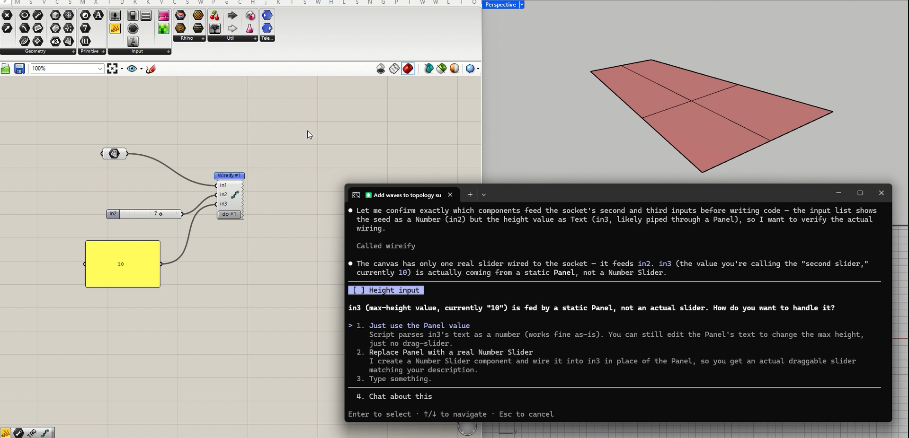
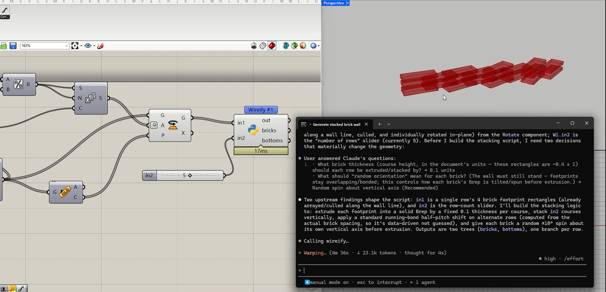
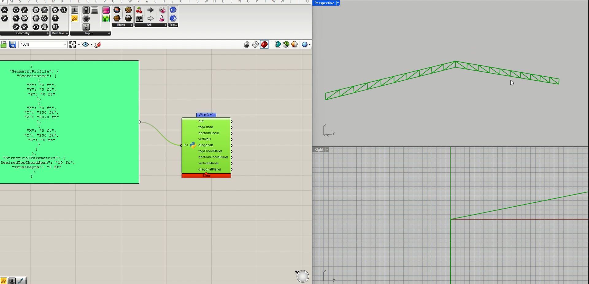

<p align="center">
  <picture>
    <source media="(prefers-color-scheme: dark)" srcset="assets/brand/wireify-lockup-dark-512.png">
    
  </picture>
</p>

# Wireify

Your own Claude Code, live in Grasshopper. One click connects a Claude terminal to your canvas: it reads the data actually flowing through your wires, writes typed Python components, runs them, reads Grasshopper's errors, and fixes them — while you watch.


**Install:** in Rhino 8 on Windows, run `_PackageManager`, search **wireify**, install, restart Rhino. Check [Requirements](#requirements) first — Rhino 8 SR18 or newer on Windows, and Claude Code on a paid plan. Mac support is planned; Rhino 7 is not supported. Building from source works too (below).

## How it works

- The plugin hosts a small MCP (Model Context Protocol) server inside Grasshopper, on `127.0.0.1:9473` (or the next free port). Loopback only, gated by a per-session secret. It never leaves your machine. It runs the official MCP C# SDK at the current protocol revision; long tool calls run to completion, and Claude Code moves anything past two minutes to the background on its own.
- **Wireify makes no AI calls and needs no account of its own.** It connects *your* Claude Code — your subscription, your data boundaries. The plugin only exposes canvas tools to it.
- Each `.gh` definition gets its own agent home under `~/.ify/wireify/projects/` (that is `%USERPROFILE%\.ify\wireify` on Windows — every `~/.ify/wireify` path in this document lives there), scaffolded with Grasshopper skills and a memory that accumulates what worked. Claude starts warm, and gets warmer per definition.
- **Each definition can also have a companion web app** — a browser page served by the same local server (`/app/<home>/`, loopback only, its own per-run access link) that stays in step with the canvas both ways: sliders and controls on the page drive the definition, watched outputs render live (tables, charts, a 3D viewport), and a drag on the page is one clean undo step in Grasshopper. The page interacts while its definition is the **front** Grasshopper tab — Grasshopper solves only the front document, so with the file in a background tab the page says "not in front" and a change made there is refused and marked on its control rather than parked unsolved; it keeps reading and streaming from the background. Ask the session for it ("make me an app page for this") — the page is scaffolded into the home's `app/` folder and belongs to you. Name its controls for people: a control in `app/manifest.json` can carry a `label` and a one-line `help`, and the 3D view opens with a short turn and its gestures. Using it needs no Claude session: open the definition in Rhino and press **Open app**; Build is for improving the page. The server pushes and reads **only** the params declared in the page's own `app/manifest.json`; the browser never holds the MCP credential. On the canvas, the Wireify component's plate shows the app's stable address and an **Open app** button once the page exists: the click mints this run's link and opens your browser; the address itself carries no token and is never written into the `.gh` (click it to copy the working link).
- **Several definitions open in one Rhino?** Each is its own session: Build on each file spawns its own terminal (titled with the file's name, carrying that definition's memory), all sharing the one local server. A session's tools are bound to the definition it was connected for — it can read its file even from a background tab, but changes only run while that file is the active canvas, and it never touches your other open files. The socket button is per-definition too: a fresh file reads **Build** until *it* has a live session (then **Session open**).

## The workflow

1. Drop a **Wireify** component (the socket) on the canvas — double-click the canvas and type `wireify` to find it. It shows a number badge — `1` — and takes the nickname `W1`. Below it sits the plate: a few lines saying what to do next, and two buttons — **Build** and, once the definition has an app page, **Open app** (it reads **no app yet** until then).
2. Save the definition (Wireify keys its home to the file path), then click **Build** (or run `_Wireify`). A terminal opens by itself, already running Claude in this definition's home; the plate reports each step, then the prompt to type. Current builds approve the home's own `wireify` MCP server for you; on an older build, approve it once when Claude asks.
3. Wire your inputs into the socket and rename them (`areas`, `pts`, `min_area`, ...). Zoom in for `+`/`-` to add inputs, like Merge. The built component keeps these names, so rename before converting.
4. In the terminal: `do #1: keep the points whose area beats min_area; return culled points and a count.` The phrasing is free-form — `do #1:` / `revise #1:` are conventions Claude understands, not fixed commands.
5. Claude reads the live input data (tree shapes, types, samples), writes the script, and converts the socket **in place** into a normal Python 3 script component — same position, wires kept, outputs solved and ready to wire on. Expect an approval prompt the first time Claude uses each canvas-changing tool (the convert here) — that is normal Claude Code permissions, not a broken install; read-only introspection never prompts.
6. Revise any time: `revise #1: also return the rejected points.` Converted components are edited in place.

The converted component is a stock Rhino component. **Files you save have no Wireify dependency** — colleagues without the plugin open them like any other definition. Only unconverted sockets (a transient authoring state) need Wireify present.

Two more things the loop gives you when you want them: ask for a **companion app page** (`make me an app page with the load sliders and the member table`) and the session scaffolds a live browser page for the definition — drag there or on the canvas, both stay in step; and from that page, **save report** bakes a frozen, self-contained HTML record of the current state (viewport image, charts, tables, inputs at capture) that opens anywhere with zero network — a deliverable, not the app. Objects the agent creates or writes carry a small blue `wireify` capsule on the canvas, so what a session added is visible at a glance (document-stored and inert — the file still opens stock everywhere; `clear_badge` removes one deliberately).

## See it work

On an existing definition: the socket's inputs come off a native chain of components. Claude traces what feeds them, asks two engineering questions (course height, what "random orientation" should mean for a wall that must stand), then builds the stacking component — every brick oriented, one branch per row:


| The user stays in the loop | Real engineering questions |
|---|---|
|  |  |



A companion app built this way is public: [halo.ifylab.dev](https://halo.ifylab.dev) runs a tensegrity definition as a browser page, with the Grasshopper file it came from beside it.

## Requirements

- **Rhino 8, SR18 (Service Release 18) or newer**, Windows (the Package Manager build is Windows-only today; Mac support is planned). Rhino 7 is not supported. On Rhino 8, legacy **IronPython 2 / GhPython components are supported today**: Claude reads them, runs them, and ports them to CPython 3 (the `wireify-port` flow); new components default to CPython 3.
- **Claude Code** installed and signed in. It needs a **paid plan — Pro, Max, Team, or Enterprise — or a Claude Console (API) account with credits** ([console.anthropic.com](https://console.anthropic.com)). **Free claude.ai accounts cannot run Claude Code**; a free login is redirected to upgrade.

Install Claude Code (the native installer keeps itself updated and puts `claude` on PATH):

| OS | Command |
|---|---|
| macOS | `curl -fsSL https://claude.ai/install.sh \| bash` |
| Windows (PowerShell) | `irm https://claude.ai/install.ps1 \| iex` |
| Windows (winget) | `winget install Anthropic.ClaudeCode` |

Then run `claude` once in any terminal and complete the browser login. Check with `claude auth status` (or `/status` inside a session, which also shows your plan). **Install or update Claude Code before starting Rhino** — Rhino captures PATH at startup, so a fresh install needs a Rhino restart to be seen.

**Model and effort:** Wireify sessions default to Sonnet 5 at high reasoning effort — the loop is tool orchestration, and the fast frontier tier keeps it responsive. The terminal is spawned as `claude --model <m> --effort <e>`, with both values read from `wireify.json` at the home's root. Wireify seeds `{"model": "sonnet", "effort": "high"}` and merges per key: values you edit are never changed, while newly introduced options are added on Build. Switch either any time with `/model` inside the session (the spawn defaults reapply on the next Build); edit the file to change one definition's standing choice, or set a value to `"default"` to use your own Claude setting for it (a deleted line comes back on the next Build — `"default"` is the release switch).

## Build from source

```
dotnet build Wireify.sln
```

- `src/WireifyGh/bin/Debug/net7.0-windows/` — copy the folder contents into your Grasshopper `Components` folder (the `.gha` plus every `.dll`, `.json`, and `home-template/` beside it).
- `src/Wireify/bin/Debug/net7.0/` — install `Wireify.rhp` via `_PlugInManager` from a folder that also contains the same dependency set.

Restart Rhino, open Grasshopper, and watch the Rhino command line for `[wireify] MCP server listening`.

## Troubleshooting

Every session writes a full log to `~/.ify/wireify/logs/` (`session-*.log` — every tool call, an entry line as it starts and its outcome with timing, plus the real error and stack on failure; `connect-*.log` — the Build steps) and streams into the Wireify panel. Lines are scope-tagged: `[wireify]` means our side, `[claude]` means your Claude Code install — the tag tells you where to look. If the log file itself can't be written (a sync tool or scanner holding it), the panel says so once and Wireify keeps retrying — the panel log always stays live.

| Symptom | Side | Fix |
|---|---|---|
| Rhino startup: `Error loading - Wireify` / `Unable to load Wireify.rhp plug-in: ID already in use` | install | Two Wireify installs — usually a manual copy in `%APPDATA%\Grasshopper\Libraries\Wireify` next to a Package Manager install under `%APPDATA%\McNeel\Rhinoceros\packages`. Rhino loads one and fails the other, and the failing copy silently never updates. Close Rhino, delete the install you don't want (for the manual copy: remove that `Libraries\Wireify` folder; for the Package Manager copy: `_PackageManager` → Installed → uninstall), restart. The panel log also warns with the exact stale path. |
| Panel: `claude not found on PATH` | `[claude]` | Install Claude Code (table above), then restart Rhino so it sees the new PATH. |
| Cannot find the Wireify panel | normal | Right-click Rhino's docked tab strip and pick Wireify (no command opens it — `_Wireify` is Build). It shows the active definition's last Build steps, its Wireify components, and Open app / Open home / Open log for that file. |
| Login page appears instead of a session | `[claude]` | Your account is on the free tier — Claude Code needs Pro/Max/Team/Enterprise or Console API credits. |
| Terminal shows `Ignoring N permissions.allow entries ... workspace has not been trusted` | `[wireify]` | Old build or a failed pre-trust step — Build again from Rhino (it re-seeds the trust), or accept Claude's trust dialog once in that terminal. |
| Every wireify tool call asks for approval | `[wireify]` | Same cause as above — the home's allowlist only applies once the workspace is trusted. Reconnect, or check the panel log for a failed "pre-trusted" step. |
| Terminal asks to approve the `wireify` server | normal (older builds) | Current builds auto-approve the home's own server (`enableAllProjectMcpServers`). If asked anyway, approve once; `claude mcp reset-project-choices` re-prompts. |
| Panel stuck at "Launched - waiting for Claude" | `[claude]` | Look at the terminal: not signed in (`claude auth status`, then `/login`), or a prompt is still waiting. |
| `/mcp` shows `wireify` as failed | both | Check the panel's Server row — the port there must match `.mcp.json` in the home folder ("Open home" button). Slow machine? Start with `MCP_TIMEOUT=60000 claude`. Then `/mcp reconnect wireify`. |
| Claude connects but tools error with "no active Grasshopper document" | `[wireify]` | Only hand-run/debug clients (no Wireify session) see this — they read whatever canvas is in front, so open a definition. Wireify-spawned terminals are bound to their own definition and read it even from a background tab. |
| Claude reports `WIREIFY_DOC_NOT_ACTIVE` | normal | That session's definition is open but not the front tab — changes only run on the canvas you are looking at (reads keep working). Click that definition's Grasshopper tab and tell Claude to continue. |
| Claude reports `WIREIFY_DOC_NOT_OPEN` | normal | The definition that session was connected to has been closed in this Rhino. Reopen it, or Build from the file you mean to work on — every definition gets its own session. |
| Socket shows an orange warning about "exactly 32767 characters" | your data | The text on that wire was clipped upstream — Grasshopper panels truncate pasted text at the Windows textbox limit (32767 chars). The full content never entered the document. Wire the file's path instead and let the generated script read the file. |
| App page: "Open this app from Rhino" (a pill on an older tab: "this app link has expired") | normal | The address needs this Rhino run's key, and keys rotate every run. Press **Open app** on the Wireify component, or click the address on its plate to copy the working link (or ask Claude for `get_app_info`). No Build needed. An older tab of the same app in the same browser comes back on its own once Open app has minted the fresh key (the browser shares it across that app's tabs). |
| App page: "No page here yet" | normal | The definition has no companion app yet — ask Claude to run `scaffold_app` in that definition's session, then reload. |
| App page pill: "definition closed — reopen it in Rhino" | normal | Reopen the `.gh`; the page reconnects on its own within seconds, no refresh needed. |
| App page pill: "not in front" (a slider on the page snaps back with "not applied") | normal | Grasshopper solves only the front document, so the page interacts only while its definition is the front Grasshopper tab. Click that definition's tab; the page keeps reading and streaming from the background either way. |
| App page pill names an `app/manifest.json` problem (a parse error with a line number, or a `manifest:` warnings strip) | your manifest | Fix the JSON at the line it names — the page returns the moment the file parses; a warnings strip means a declared entry could not be used (the `id` must be the component's guid; the output name goes in `param`). |
| First session in a home may ask to approve an import of `~/.ify/wireify/defaults.md` | normal | Depends on your Claude Code version: on current builds the pre-trusted home imports your shared defaults silently; older builds confirm the external import once per home (it lives outside the project folder). If asked, approve — declining leaves your shared standards unloaded for that home. |
| A session asks to review or approve the home's hooks | normal | Version-dependent, same class as the row above. The home ships three small local scripts (the lesson gate — see Trust and privacy) that remind a session which changed the canvas to record its lesson. Approve to keep the gate; declining only disables the reminder. |
| The plate says "save the definition first — Wireify keys its home to the file path" | normal | Save the `.gh` first; the agent home is keyed to the file path. There is no dialog — the warm line clears itself, and Build and Open app both answer with it until the file is saved. |
| Saved the definition under a new name; the plate says "saved under a new name — the app stays with `<old>.gh`" | normal | A home (memory, app page) is keyed to the `.gh` path, so the renamed file starts without one; a live Claude session follows the renamed file. Build on the new file starts its own home; the old file keeps its app — and its page keeps showing the old file only: it reads "definition closed" until that file is open again, and with both open it follows the original whichever tab is in front. |
| Closed the Claude terminal, want it back | normal | On Windows, Wireify notices when the last terminal for a file closes — the socket button and panel return to **Build**; click either. With another terminal still open for that file the button stays **Session open** (use that terminal, or right-click → **New Claude session**). Anywhere: right-click any Wireify socket → **New Claude session**. Fresh terminal, same home, memory intact. |
| Rhino restarted (or crashed) mid-session | normal | The restart ends the session's local server, so the old Claude terminal can no longer reach Rhino. Build again from Rhino (socket button or `_Wireify`) — a fresh terminal opens in the same home: memory, lessons, and logs persist; the previous conversation does not carry over. |
| Rhino crashes when the first Python 3 component loads | Rhino | Known RhinoCode initialisation fragility on some installs, not Wireify-specific. Update to the latest Rhino 8 SR; if it persists, close Rhino and clear the script cache at `%APPDATA%\McNeel\Rhinoceros\8.0\RhinoCode`, then open the ScriptEditor once before using Wireify. Claude checks the runtime before its first create and warns instead of flailing. |
| Anything unclear | both | `claude doctor` checks the install; `claude --debug` (or `/debug` in-session) logs MCP traffic; compare with the panel log. |

## Dev mode (tester feedback)

For anyone helping test Wireify: say `dev mode on` as the first message of a session, and Claude keeps a structured log of that session's findings — bugs, friction, things that worked — in `~/.ify/wireify/devlog.md`, then stays out of the way. `log: <note>` records a remark verbatim; `dev mode wrap` closes the session with a short summary. It is off unless you ask for it, per session, and the file never leaves your machine — you hand it over yourself if and when you choose.

## Trust and privacy

Loopback only. Per-session secret. No outbound network calls, no telemetry, no reading of your Claude credentials — the plugin's job ends at launching your own CLI in the right folder.

The **companion app** rides the same boundary. Its pages are served only on `127.0.0.1`, behind a per-home access link that rotates every Rhino run (the token rides the URL once, then a strict session cookie takes over). The **Open app** button on the canvas opens that link in your default browser — the click is the consent, nothing is stored — and the address the component prints carries no token, so it never opens the app by itself and never travels with a shared `.gh`. The server reads and pushes **only** the params declared in that home's `app/manifest.json` — request bodies never choose params — and the browser never sees the MCP credential. Everything the page runs is local and ships with the plugin: the `.ify` design kit (`app/kit/` — styles, a small sync library, three OFL-licensed fonts with their NOTICE) and a **vendored three.js** (`three.module.min.js` + `three.core.min.js` + OrbitControls, r180, `NOTICE-three.txt` beside them) for the 3D viewport — no CDN, no external fetch, nothing leaves the machine. The viewport's meshes come from a loopback-only `api/geometry` endpoint that answers solely for views the manifest marked `"geometry": true`. The **baked report** is a file the page builds in your browser and hands to your Downloads — self-contained, zero-network, frozen at capture; it leaves your machine only if you send it to someone. The blue `wireify` **canvas badge** is plain document data (Grasshopper's own value table): it records which objects the agent created or wrote, saves only when *you* save, and a badged file opens stock on machines without Wireify.

One deliberate convenience, stated plainly: Build marks the generated home folder as trusted in `~/.claude.json` (`hasTrustDialogAccepted`) and the home's settings auto-approve **only** the `wireify` server from its own `.mcp.json`. Both apply exclusively to folders Wireify itself scaffolds — never to your project folders — and exist so read-only introspection works without a wall of permission prompts. Delete the key or the setting if you prefer the prompts.

Everything Wireify persists stays under `~/.ify/wireify` (`%USERPROFILE%\.ify\wireify`) on your machine. Nothing leaves it:

- `projects/<home>/` — one home per definition: the `MEMORY.md` lesson ledger, its `MEMORY-archive.md` overflow, timestamped `.bak` snapshots taken before any maintenance, the companion app's `app/` folder (your page, manifest, and theme, plus the Wireify-owned `app/kit/` refreshed at Build), and `.wireify/home.json` — the identity record (the definition's path, a content hash, the last Build time, and orphan/adoption stamps) that lets a renamed or moved `.gh` reconnect to its accumulated memory. When an adoption could not be resolved automatically, `.wireify/adoption-candidates.json` lists the unmatched orphaned homes for a user-confirmed recovery. The home also carries the lesson-gate state — `.wireify/hooks/` (three small scripts the session's hooks run) plus `session-start-marker`, `mutations.log`, and `review-done` — used only to remind a session that changed the canvas to record its lesson before ending; every check is a local file test, no model call, nothing transmitted.
- `archive/` — homes whose `.gh` disappeared, aged in after 90 days. Never deleted.
- `homes.md` — a human-readable index of every home's record, regenerated on each Build. A read-only snapshot, never an authority.
- `defaults.md` — your shared standing conventions, imported into each session (silently on current Claude Code builds, or after the one-time approval above).
- `skills/` — your shared skill folders, copied into each home at Build.
- `devlog.md` — dev-mode findings, written only after you turn dev mode on in a session.
- `logs/` — the session and build (`connect-*`) logs.

## License

Apache 2.0.
